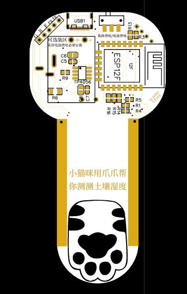
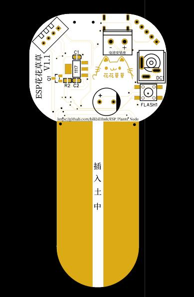

# ESP_Plants_Node
基于ESP12F|ESP07的土壤湿度，空气温湿度检测节点及后端
# 项目服务端 keai.icu/hhcc

该项目主要为培养全能工程师而设计的教学方案，该方案包括对硬件的设计及理解、电路原理及分析、电子焊接、外观设计、嵌入式开发及算法优化、网络通信、服务器部署及环境搭建、数据库设计及网络API设计，网站建设及用户管理。可对整个项目进行二次开发，可有效培养对整体物联网项目开发过程的认知。通过实体项目让冰冷的理论知识在自己手中实现出来，可应用于电子、物联网等专业培训及实训。

## pcb设计 
  
  

## 外观设计

  

资金困难 暂时搁置

