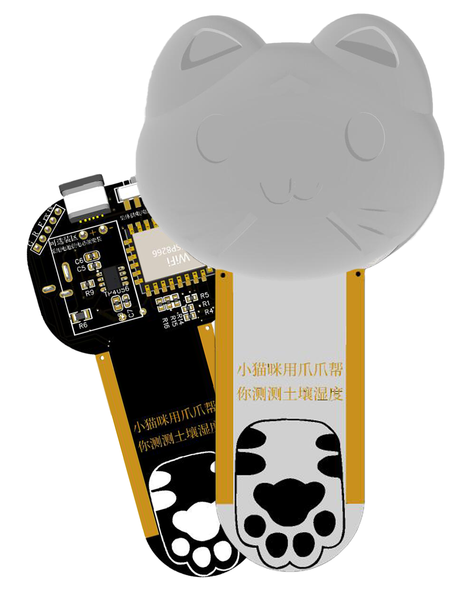
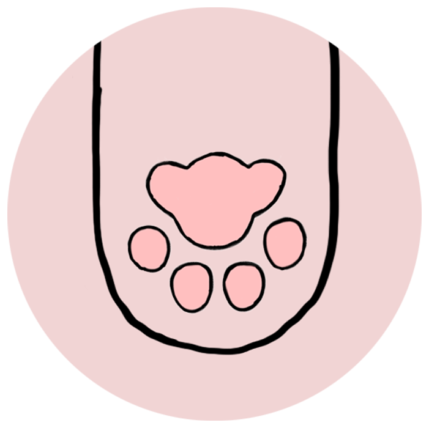
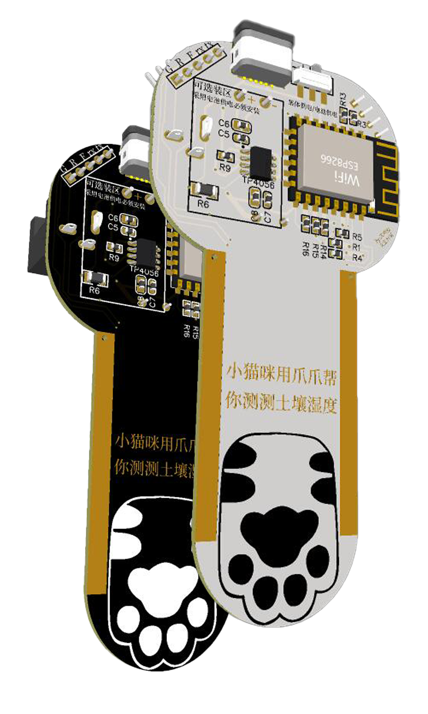
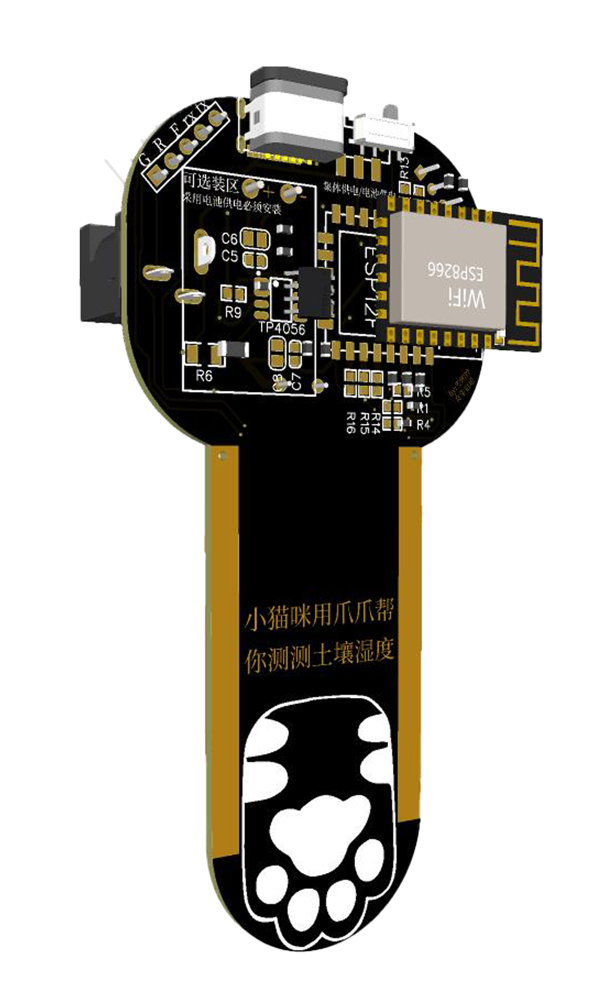
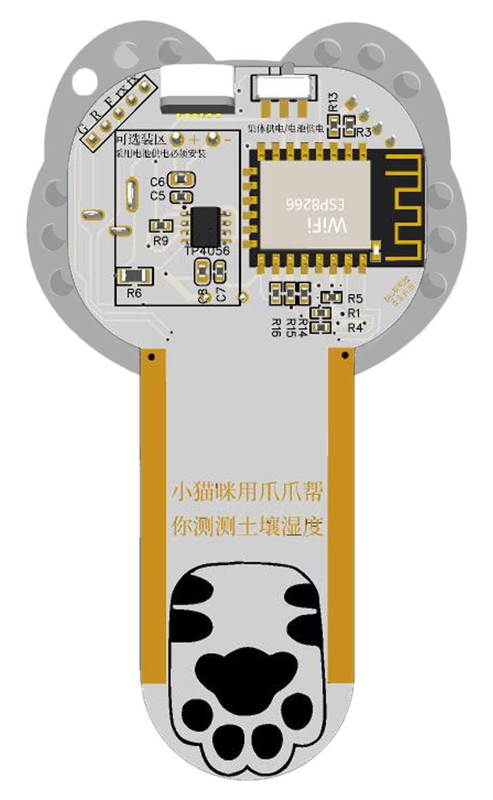

# 花花草草硬件节点
基于ESP12F|ESP07的土壤湿度，空气温湿度检测节点 

## [ESP_Plants_Node](https://github.com/bilibilifmk/ESP_Plants_Node)为硬件端 [Plants_Node](https://github.com/bilibilifmk/Plants_Node)为服务端 分为两个项目管理

# 还在开发！！！ 无法使用状态！！！

 

# 云平台地址 keai.icu/hhcc
# 后端服务项目地址：
# 数据上报地址：http://keai.icu/hhcc/update
# PCB及原理图：
# 简介：
  
## 该项目主要为培养全能工程师而设计的教学方案，该方案包括对硬件的设计及理解、电路原理及分析、电子焊接、外观设计、嵌入式开发及算法优化、网络通信、服务器部署及环境搭建、数据库设计及网络API设计，网站建设及用户管理。可对整个项目进行二次开发，可有效培养对整体物联网项目开发过程的认知。通过实体项目让冰冷的理论知识在自己手中实现出来，可应用于电子、物联网等专业培训及实训。

# 说明 
* 需要使用WiFi_link_tool 库
* 硬件基于ESP8266作为主控
* 通过拨动开关可切换集体供电或电池供电 集体供电通过DC接口（5v） 可适用于花盆众多情况
* 可通过选装区域增加电池 电池型号903035 （900毫安时） 理想续航一个半月
* 定制自己的固件可在data目录将KEY.txt和API.txt内容进行相应修改 通过文件系统上传 
# 操作流程
  * 编译并烧录固件及上传文件系统
  * 对设备进行配网（连接wifi WiFi_link_tool 如没弹出配网页 使用浏览器手动访问6.6.6.6）
  * 配网完成后（直接在文件系统修改可跳过此步）访问设备IP地址 第一次启动 会持续三分钟服务，三分钟后进入休眠 进入休眠后设备将无法进行配置等 进入每一小时上报一次数据
  * 在服务平台中可对设备进行命名等操作
  * 注 重新配置 可在启动后 联网成功 指示灯开始闪烁 对其断电 这样视为第一次启动状态 三分钟后进入休眠 请配合串口监视器

# 图片：
   
 
 
 

